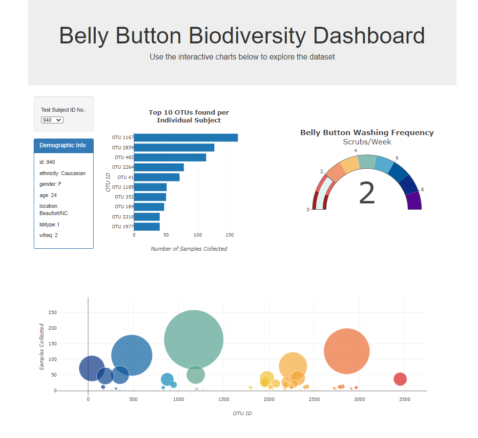

# Belly Button Biodiversity Dashboard
## Overview
This interactive dashboard allows the user to explore the [Belly Button Biodiversity dataset](http://robdunnlab.com/projects/belly-button-biodiversity/), which catalogs the microbes that colonize human navels. Select a participant's anonymous ID from the dropdown menu to view their demographic info, the top 10 microbial species found in their navels, the prevalence of each microbe found, and a gauge chart that displays the weekly washing frequency of the individual.

Dashboard launch page:

